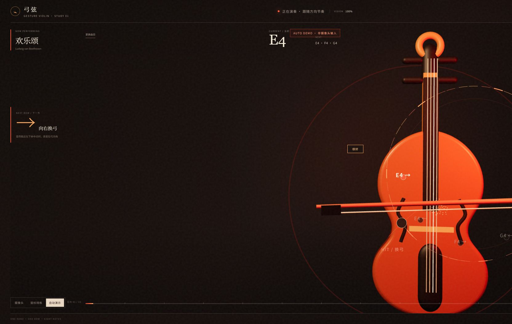
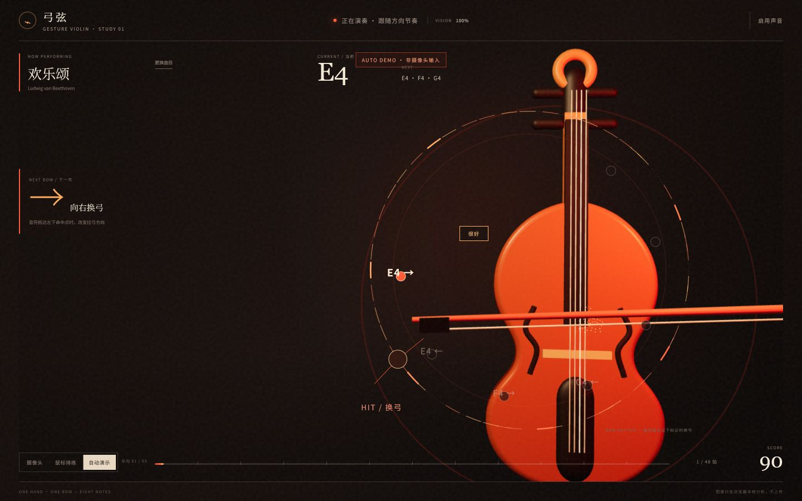
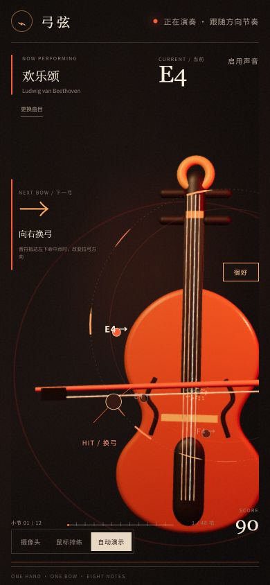

# Camera stage, MIDI 与低延迟验收记录

- 日期：2026-07-21
- 分支：`feature/gesture-violin-mvp`
- 环境：Windows，Codex 内嵌 Chromium（版本未暴露），本地 Vite `http://127.0.0.1:5173/?demo=1`
- 目标站点：Netlify `gesture-violin-lab-664` / `29931500-0653-4cc2-af3a-1370ebe20b13`
- 部署状态：测试预览已部署；现有生产站点未覆盖

## 自动化验证

最终文档提交前重新执行以下命令：

```text
pnpm music:import                              PASS（欢乐颂 47 音，卡农 61 音）
git diff --exit-code -- src/music/generated   PASS
pnpm test                                      PASS（90 / 90）
pnpm build                                     PASS
git diff --check                               PASS
```

Vite 生产构建仍给出单个 JavaScript chunk 超过 500 kB 的提醒，不影响构建退出状态。`@tonejs/midi` 只在 Node 导入脚本中使用，未进入浏览器运行时代码。

关键逻辑覆盖包括：

- `VideoFrameGate` 对同一媒体帧只接受一次；跟踪循环使用 `requestVideoFrameCallback`，不存在固定 28 Hz 轮询。
- MediaPipe 创建优先 GPU；自动化测试模拟 GPU 创建失败，并确认按 `GPU → CPU` 顺序成功回退。
- 快速换弓在两个摄像头帧内跟随；静止手部抖动不会触发拉弓。
- 环形弧角随 transport beat 靠近命中点，弧长随 `durationBeats` 变化；末尾不完整小节会夹到歌曲总拍数。
- 音符、伴奏和计分事件每拍最多触发一次。

## 视口与视觉结果

### 2048 × 1055



提琴与环形节奏轨位于右侧，左侧保留表演者安全区；曲目信息、换弓方向、命中点与总进度没有互相遮挡。外圈允许在右缘局部裁切，形成舞台延展感。

### 1440 × 900



常见桌面尺寸下，提琴主体完整可辨，琴弓横向延伸到画面边缘；左侧方向提示与右侧节奏轨层级清晰。

### 390 × 844



移动端保留右侧提琴、左下命中点和底部小节轨。曲名、当前音、方向提示与分数均在视口内，没有横向滚动。

## 摄像头与输入降级

- 静态实现确认：`video.camera-stage` 固定铺满视口、`object-fit: cover`、水平镜像；三维画布和 HUD 叠在视频上方，提琴保持右侧。
- 内嵌验收浏览器点击“摄像头”后进入 `getUserMedia` 权限等待，但该环境没有暴露可操作的摄像头权限弹窗。因此本轮没有获得真实画面，也没有记录实际 delegate、`trackingHz` 或推理耗时。这三项明确记为未实测，不以自动演示数据代替。
- “鼠标排练”在重新加载后的可操作阶段成功切换，`data-mode` 为 `rehearsal`、置信度回到 0%，自动演示徽标消失，摄像头视频被隐藏。
- GPU → CPU 回退已由单元测试强制模拟并通过；真实硬件回退仍应在可授予摄像头权限的 Chrome / Edge 上复测。

## 曲谱与环形 UI

- 《欢乐颂》来源：Mutopia Public Domain，SHA-256 `fb1604c08c865b275b464d74e5a7c526ff1a8acccdf9853cb92f0778daaed14b`。首句为 E4、E4、F4、G4。
- 《D 大调卡农》来源：Mutopia CC BY 3.0，SHA-256 `1358ba0799aeb727be0ef155fc9090ea55762a3b41f85d3dbb02918f4ac66515`。首句为 D5、C♯5、B4、A4；选曲界面显示 CC BY 3.0 署名和来源链接。
- 浏览器切换验证：欢乐颂切换前可见 7 个 `[data-cue-id]` 节点；选择卡农后立即变为 4 个，并显示卡农首音 D5，没有遗留上一首的 SVG 提示。
- 两首曲目的首音、总拍数、最终小节/乐句进度与来源 manifest 由自动化测试锁定；方向同时由箭头、文本和弧线样式表达。

## 测试预览部署

- 源提交：`b1f4747`
- Netlify deploy ID：`6a5f9e14d08a1cd9cb84572b`
- 测试地址：<https://b1f4747-test--gesture-violin-lab-664.netlify.app>
- 冒烟结果：首页 `200`，构建产物 CSS / JavaScript 均为 `200`，页面标题正确，`Permissions-Policy` 为 `camera=(self), microphone=()`。
- 本次为 draft deploy；没有覆盖 <https://gesture-violin-lab-664.netlify.app>。

## 未解决项与上线前复测

1. 在可操作摄像头权限的桌面 Chrome / Edge 上记录真实 GPU/CPU delegate、稳定 `trackingHz`、平均推理耗时，并实际检查表演者位于左中区域时的遮挡。
2. 用真实手势复测快速反向、静止抖动、摄像头切换到鼠标时的设备释放；当前这三项分别有逻辑测试或 DOM 降级验证，但没有真实视频证据。
3. Vite 的大 chunk 提醒可在后续性能专项中通过动态导入 Three.js / MediaPipe 路径处理。
4. 当前仅部署测试预览。获得明确的生产发布批准后，按 README 中的站点 ID 发布，并对生产域名的 HTTPS 摄像头路径再做一次冒烟测试。
